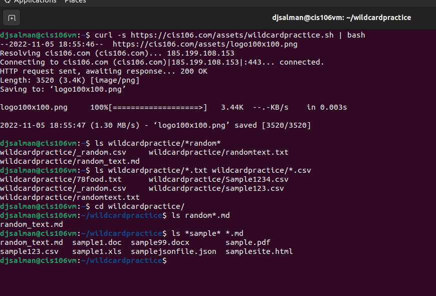
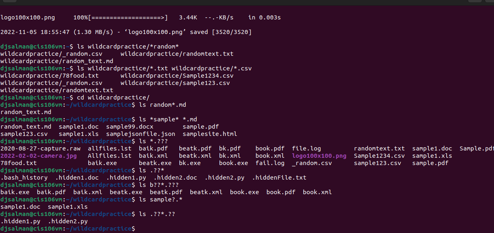
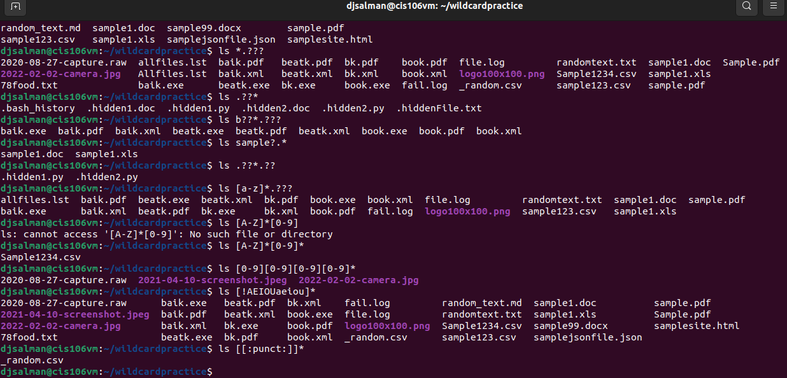

...
name: your name
course: cis106
semester: fall 22
...

# Week Report 6

##  Wildcards.

### * Wildcard
the * wildcard matches from 0 to any number of characters.
* Examples:
  * List all the text file in a directory
    * `ls *.txt`
  * List all the files that start with the word file
    * `ls file`
  * Copy all the mp4 files
    * `cp Downloads/*.mp4 ~/Videos/movies/`
  
### ? Wildcard
the ? wildcard matches a single character.
* Examples:
  * list all hidden files
    * `ls .??*`
  * List all the files that have a 3 letter file extension
    * `ls *.???`
  * List all the files that have a single character between letter f and l.
    * `ls f?l*`

### [] wildcard
The [] wildcard match a single character in a range.
* Examples:
  * to match all files whose name has at least one number.
    * `ls *[0-9]*`
  * To match all files that have a range of letters after f.
    * `ls f[a-z]`
  * to match all files that have a vowel after letter f.
    * `ls f[aeiou]*`

### Brace Expansion
brace expansion {} is not a wildcard but another feature of bash that allows you to generate arbitrary strings to use with commands.
* Examples:
  * remove multiple files in a single directory
    * `rm -r {dir1,dir2,dir3,file.txt,file.py}`
  * to create a whole directory structure in a single command:
    * `mkdir -p music/{jazz,rock}/{mp3files,videos,oggfiles}/new{1..3}`
  * To create a N number of files use:
    * `touch website{1..5}.html`

## Practice

practice 5

practice 6

practice 7
